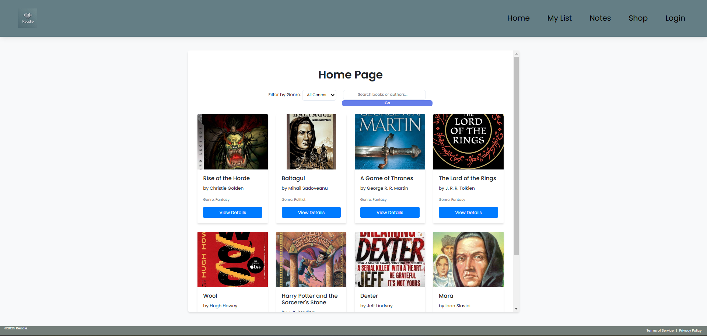
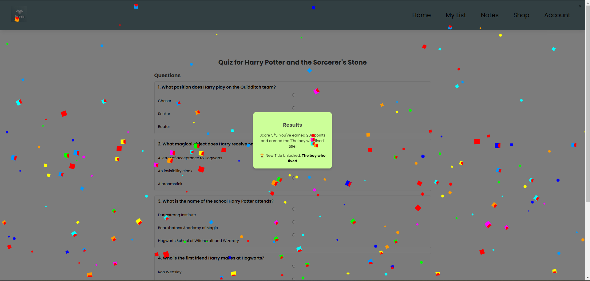
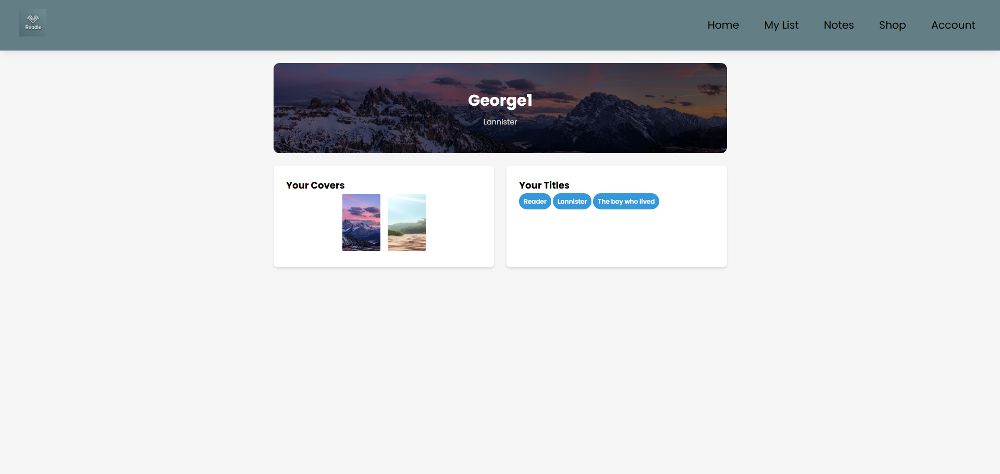
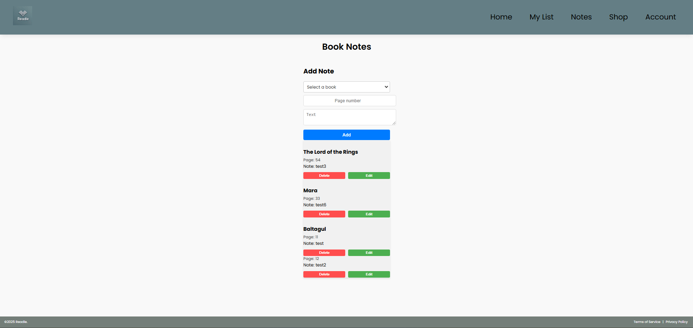
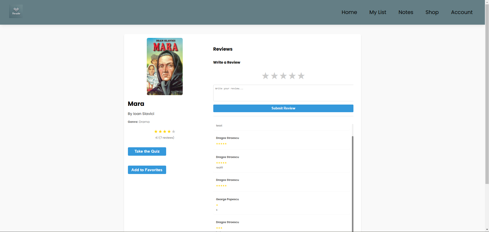

# Readle

**Readle** is a dynamic, gamified reading platform designed to make reading fun and engaging. It encourages users to read more by transforming the reading experience into an exciting, rewarding adventure.

## Overview

Readle transforms the reading experience by combining interactive quizzes, customizable profiles, and social features. Earn points by taking quizzes generated by a large language model (**LLM**), unlock special titles for perfect scores, and use your points to customize your profile. Beyond quizzes, you can add notes about books, rate them with stars, and write reviews—all while engaging with a vibrant community of readers.

## Features

- **Gamified Quizzes:**  
  Challenge yourself with quizzes tailored to your reading. Earn points based on your score—with a perfect score granting you a prestigious title to display on your profile.

  

- **Customizable Profiles:**  
  Personalize your profile with custom background images available from our online shop. Spend the points you earn to create a profile that truly reflects your style.
  

- **Book Notes** 
    Add books to your list and then be able to write notes for a specific page, you can view all the notes you have in the notes page.
    

- **Join the Community:**  
  Document your reading journey by rating them, and sharing your reviews to help guide other readers. You and your fellow readers have the option to leave commments on your favorite books and discuss just how enjoyable a book is, the rating of the book will indicate that too.
  
  

- **Cloud Storage with Firebase:**  
  All user data and content are securely stored in the cloud using **Firebase**. This ensures robust, scalable, and reliable storage for your reading journey.

- **Authentication System:**  
  A secure, built-in authentication system allows you to safely create and manage your account, ensuring a personalized experience, made using **Firebase Autentification**.

## How It Works

1. **Take a Quiz:**  
   Engage with dynamic quizzes that test your knowledge about the book you're reading. Your performance earns you points.

2. **Earn Points & Unlock Titles:**  
   The higher your score, the more points you earn. A perfect score even unlocks a special title that you can proudly display on your profile.

3. **Customize Your Profile:**  
   Use your earned points to purchase unique background images and profile enhancements from our online shop.

4. **Document Your Journey:**  
   Add notes about each book, rate them with stars, and leave thoughtful reviews to document your reading experience and help other readers.

5. **Join the Community:**  
   Connect with fellow readers, share your achievements, and explore new books through community interactions.

Enjoy your reading journey with **Readle** and help us make reading an exciting, interactive adventure!